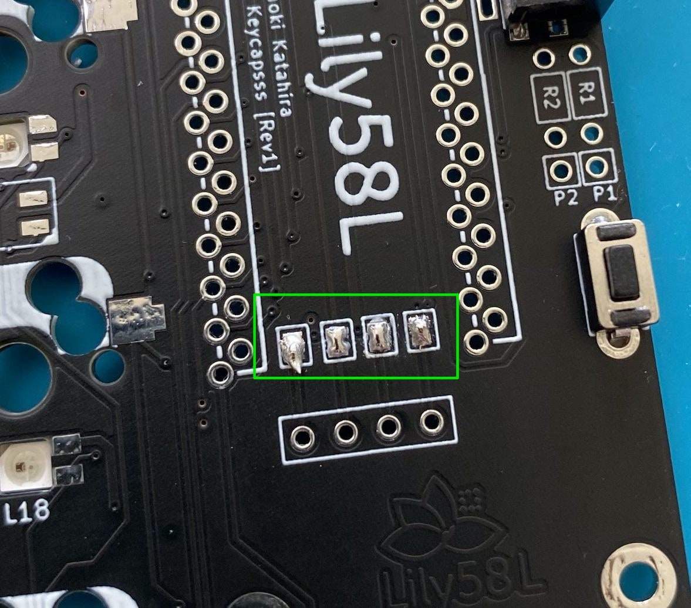
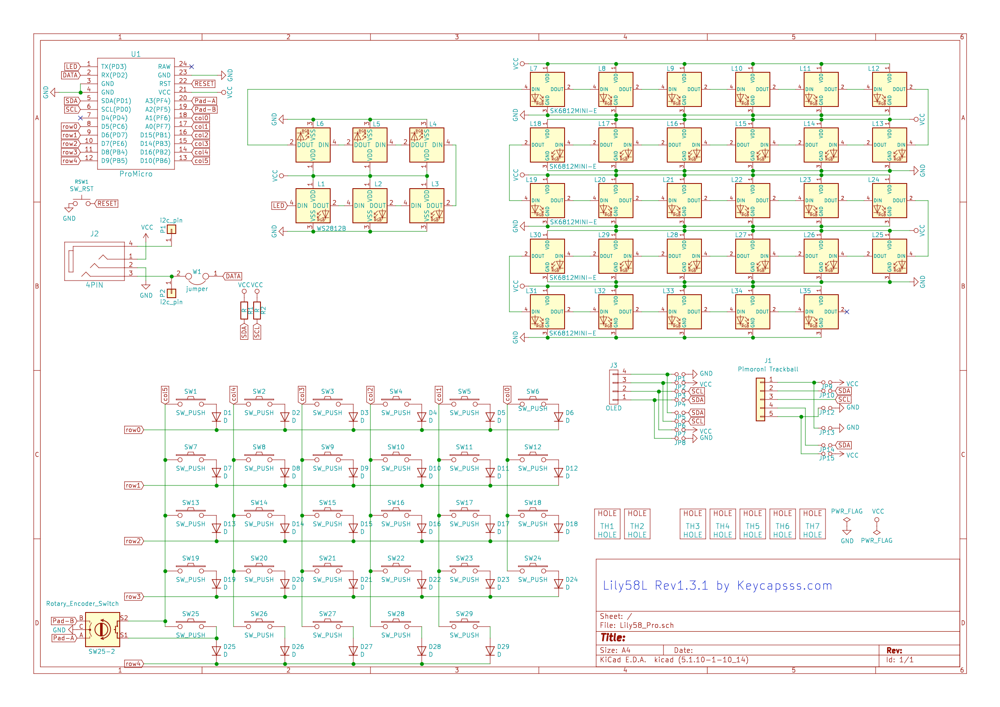
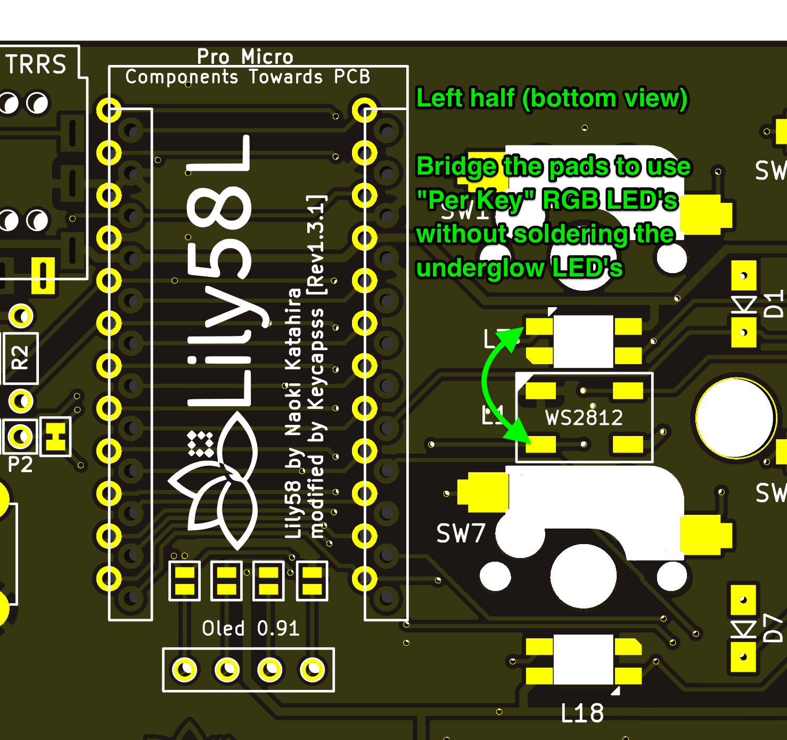
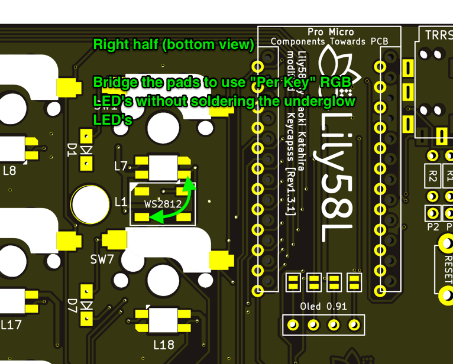

# Lily58L Pro Build Guide

<!-- TOC depthfrom:2 depthto:2 -->

- [BOM](#bom)
- [Introduction](#introduction)
- [Attach the diodes](#attach-the-diodes)
- [Solder the led's for underglow optionally](#solder-the-leds-for-underglow-optionally)
- [Solder the led's for keycap back optionally](#solder-the-leds-for-keycap-back-optionally)
- [Soldering the TRRS jack and reset switch](#soldering-the-trrs-jack-and-reset-switch)
- [Attach the OLED display](#attach-the-oled-display)
- [Install Pro Micro with sockets](#install-pro-micro-with-sockets)
- [Solder the rotary encoder](#solder-the-rotary-encoder)
- [Solder the sockets](#solder-the-sockets)
- [Case assembly](#case-assembly)
- [Flash keymap on Pro Micro](#flash-keymap-on-pro-micro)
- [Default keymap](#default-keymap)
- [Operation check](#operation-check)
- [When in trouble](#when-in-trouble)
- [Customize the default keymap](#customize-the-default-keymap)
- [Use "Per Key" LED's without underglow LED's](#use-per-key-leds-without-underglow-leds)

<!-- /TOC -->

## BOM

### Required parts

Part name | Quantity | Remarks | Photo |
| ------- | -------- | ------- | ----- |
| Lily58L PCB | 2 pcs ||
| Lily58L case | 1 set | 2 solid panels, 2 with holes for switches |
| [Pro Micro](https://keycapsss.com/keyboard-parts/parts/79/arduino-pro-micro-atmega32u4-controller), [Puchi-C](https://keycapsss.com/keyboard-parts/mcu-controller/141/puchi-c-pro-micro-replacement-with-usb-c-and-atmega32u4) or Elite-C | 2 pcs (a mix is possible) | Optionally, use [Mill-Max Single Row Socket Headers](https://keycapsss.com/keyboard-parts/parts/100/single-row-socket-headers-pins-mill-max-series-315), to make it hot-swappable. ||
| Key switch (MX) | 58 pcs |  ||
| [Kailh switch socket](https://keycapsss.com/keyboard-parts/parts/49/kailh-hot-swap-pcb-sockets-10-pcs) | 58 pcs |  ||
| Diodes 1N4148W (SMD) | 58 pcs |||
| TRRS jack | 2 pcs ||
| Tactile switch | 2 pcs | Reset switch ||
| TRRS cable | 1 cable | Must be a 4-pole cable ||
| Key caps | 58 pcs | 1.5U caps, can also be 1U ||
| Micro USB or USB-C cable | 1 pcs | Dependent what you use on the master half. ||

### Optionally parts

Part name | Quantity | Remarks | Photo |
| ------- | -------- | ------- | ----- |
| [OLED module](https://keycapsss.com/keyboard-parts/parts/80/ssd1306-oled-lcd-display-0.91-inch-128x32-i2c-white) | 2 pcs | It is possible to use only one display ||
| SK6812 Mini | 12 pcs | RGB led's for underglow ||
| SK6812 Mini-E | 58 pcs |RGB led's for keycap backlight **(underglow led's must be soldered, because they are connected in series)** ||

## Introduction

**Note that the case of the black version has a scratch-resistant paint (solder resist) that can arrive with scratches from shipping and transportation. This is the nature of the product.** 

**In addition, please be careful, as the case will be scratched if it hits or rubs a hard thing after assembly.**

This PCB is reversible. We will mount parts **on each side.**

Mark the surface with masking tape to make it easy to keep track of the back and front of each board.

## Attach the diodes

The diodes are mounted on the **back side** of the board.

Pay attention to orientation, Diodes are polarized. If the orientation is incorrect, the key will not respond.

Solder the diode as shown in the following figure.

Apply preliminary solder (melt a small amount on the substrate) on one pad of the PCB diode.

Then use tweezers to solder one side of the diode, using the pre-soldering to secure the diode.

Then solder the remaining side.
  
When all diodes have been soldered, check for missing spots.

You can use a multimeter on the front side of the board to ensure that the solder connections are good and that the orientation of the diodes is correct.

## Solder the led's for underglow (optionally)

Solder the SK6812 Mini led's (without legs), to the marked positions on the **back side** of the board.

**Pay attention to orientation of the led's.**

The led's are connected in series. If a led is broken or has bad solder connections, the following led's will not light up.

## Solder the led's for keycap back (optionally)
> **It is necessary to solder all SK6812 Mini led's (underglow) in the previous step, to use the led's for the keycaps (all LED's are connected in series).**

Solder the SK6812 Mini-E led's (with legs), on the **back side** of the board.  
**Pay attention to orientation of the led's.**

We solder LED's using the same approach as for the diodes.In that case: tin one pad, put the LED on, reflow, solder the other three pins.

Correct orientation from the front view.

Begin by pre-soldering one side of the Led pad, place the component, and hold it in place with tweezers.

It is necessary to solder all led's, even if you use the rotary encoder.

For the LED's it's important to keep the heating as short as possible. Try to not touch the LED itself with the iron but rather only the solder that's supposed to connect to the metal pin. Use flux. 
The led's are connected in series. If a led is broken or has bad solder connections, the following led's will either not light up at all or will light up in a different color than the default (red).
Double-check the last LED that lights up properly and the first that doesn't.
On the LED's with legs it's easily possible to get a loose connection. 

## Soldering the TRRS jack and reset switch

The TRRS jack and the reset switch are mounted on the **front side** (opposite side of diodes).
Attach the parts and fix them temporarily with masking tape. Turn over the board and solder the pins, making sure that the TRRS jack and reset switch are in firm contact with the board.

**be careful** don't be careless doing this part. TRRS jacks are parts you can indeed mess up. I promise.

## Attach the OLED display

On the **front side** of the board, apply enough solder to bridge the four jumper terminals in the Pro Micro section.

Attach the connector for the OLED on front side (opposite side of diodes). Be careful to avoid adding a lot of solder, as it is easy for solder to flow into the connector.

## Install Pro Micro (with sockets)

**Before installing the Pro Micro, no matter which (can also happen on the Elite C), check whether they are working by plugging them in and flashing the default keymap.**

**When Installing the Pro Micro Puchi-C or Elite C, be sure it has the right orientation! The chips on the Board have to face downward and the USB Port is on the upper edge of your Board.**

The pin header enclosed in the bag of Pro Micro can be used, but i recommend to use the Mill-Max socket headers.
With the Mill-Max header it's easier to replace the Pro Micro, if it's broken. (Especially the Pro Micros will break at some point)

Note the **outlined sets of holes in PCB,** and insert the Standard header/Mill-Max sockets into the outlined holes on the **front side**. Please be careful, as the **connections are different for the right and left boards.**

Solder the Standard header/Mill-Max sockets from the **back side**.

Insert the pins (you can also use legs from through hole diodes/resistor) with a pliers into the sockets.

Place the Pro Micro **(Micro-USB socket facing down)**.

Solder the pins and shorten the pins with diagonal pliers.

For other ways to mount your Pro Micros, look at [the crkbd build guide.](https://nicedoc.io/foostan/crkbd/blob/master/corne-classic/doc/buildguide_en.md#using-pin-sockets)

Before you ask: The Procedure is absolutely identical for the Elite-C.

### Some tips for installing the OLED on the socket

- if you soldered the socket for the OLED, remove the black plastic thingy that's part of the header installed in the OLED. The you'll be able to shorten it's legs with your pliers and put them into the socket, resulting into a way more low profile OLED.  
- If you do not have sockets installed, you can add height to the oled, by removing pins out of headers, and putting the empty black plastics part onto the headers of the OLED.

> Add image here: "Soldered 4pin socket for Oled"

## Solder the rotary encoder

Soldering the rotary encoder is as simple as any other component. Put the encoder from the front into the holes on the PCB, just below the screen, and solder it from the back.

**Tip** Depending on your case you should first try and bend the rotary encoder legs a bit before soldering it in. The legs can prevent your case from closing completely, as it will rest on the protruding legs. Bending the pins so that they are flush with the encoder helps here. (you can also just clip them off)

**For your information.** The top **two** legs serve as a simple connection that is closed by the rotary encoders tactile press. It's connected to the pins a switch would be connected to, if there were on in the place of the rotary encoder. Therefore, in your firmware the rotary encoder will serve, among other things, as a switch in the matrix.
The lower three pins do the actual rotary-encoding part

### You have reached a checkpoint

Plug your keyboard, look what happens, solve problems, be happy if there are none. (if you followed all the steps your pro micros should have firmware at this point)
By now you can also checked whether all switches will be able to work. In order to do so, short the pads on which the kailh sockets will be installed (next step) with tweezers.

> Add image here: "Test switches with tweezers"

## Solder the sockets

The sockets are mounted on the **back side**, the same side as the diodes.

Much like the approach used for the diodes above, begin by pre-soldering one side of the socket pad, place the component, and hold it in place with tweezers. (The sockets can also be held in place by hand, but please take extra care not to burn yourself.)
The image shows a soldered MX socket.

The sockets take **way** more solder than the other components like the LED's and the diodes. But don't exaggerate... 

> Add image here: "Kailh hot swap sockets"

## Case assembly

### Attach the spacer

Attach four 10mm round spacers to the holes near Pro Micro.
It's easy to insert a screw from the back of the board and attach the spacer from the top.

Peel off the masking tape used to identify the front and back of the board.

### Attach the key switch

Attach the top plate spacers for alignment. (MX: 7mm Choc: 4mm)

Attach four key switches to the top plate. (In the case of Choc switches, starting with two switches in the plate may be easier.)

  
Insert the switch into the board for alignment, and line up the components.

After confirming that there are no bends in the switch pins, you can attach it firmly by starting from the middle row and working outward.
Be careful: Kailh BOX switches and Choc switches require some power for installation.
Always be careful to put the switches in nice and straight, otherwise you'll bend the pins and scratch the PCB.
After mounting the plate, push the switches again to make sure that installation is complete.

### Pro Micro protective acrylic installation

Peel off the protective plastic layer covering the acrylic, and attach the acrylic to the board.
**Mount with the wider side (labeled "幅が広い" here) outwards.** 

.

## Flash keymap on Pro Micro

The board requires a keymap in order to function. This section assumes that you're familiar with keymaps and the use of the QMK tool. If not, please refer to [the QMK "Getting Started" guide](https://docs.qmk.fm/#/getting_started_build_tools) (Windows: MSYS2; Mac, Linux: avrdude)

The [QMK Toolbox](https://github.com/qmk/qmk_toolbox/releases) can be used to write non-customized keymaps via a GUI, avoiding the need to configure a local QMK environment. (For custom keymaps, it's recommended to build the full environment described above).
 
Clone/download the QMK firmware and execute the following in the [qmk_firmware](https://github.com/qmk/qmk_firmware) directory to write the default Lily58L keymap

    make lily58/light:lily58l:avrdude

When **`Detecting USB port, reset your controller now...`** is displayed, press the reset button on the keyboard to start writing.
Each half of the keyboard must be programmed separately using this approach.

If you're using DFU bootloader (in case of the elite c), replace the 'avrdude' with 'dfu'

## Default keymap

The default keymap is laid out on the assumption that it will be used in the MacOS/US keyboard environment. Feel free to get creative and experiment with keymaps that match your preferences; consider changing to the JIS layout or adding a key to switch between English and Kana, for example.

The best of my own keyboard:

## Operation check

Connect the left and right sides with a TRRS cable, connect the Micro-USB cable to Pro Micro on the left side (in the case of the default keymap), and check if the key responds.
The build is completed by attaching the four rubber feet to the back of each board. Thank you for your hard work.

### Congratulations(?)

If everything works: You have built your lily58L. Have fun!
If something doesn't work:

## When in trouble

### Q. One or more rows/columns of key switches do not respond

A. The Pro Micro board may not be soldered and attached firmly. Check again, and re-solder and reinstall if necessary.

### Q. A single key switch doesn't respond

A. There may be a problem with the key switch's insertion, socket or diode soldering.

In the case of bad key switch insertion:
After removing the key switch, make sure that the pins aren't bent, and then push it in again and install it.

In the case of badly attached socket:
Re-solder the problem socket, or reflow and add solder if the joint is weak.
  
In the case of badly attached diode:
Check the direction of the diode in question. If it is wrong, remove it and re-solder it. Additionally, if there isn't enough solder, please re-solder.

### Q. A symbol different from the symbol input by "@" or "[" etc. is input (on Windows, etc.)

Since recognition of keyboard is recognized as JIS keyboard on OS, another symbol will be input when inputting with Lily 58 (treated as US keyboard).
Please set Lily 58 as a US keyboard in the OS keyboard settings. After switching, switching to Japanese input becomes the switching key for the US keyboard, and it differs from the JIS keyboard, so please be careful (it can be customized with the keymap etc.).

**If you have any problems, please feel free to send a message on [Discord](https://discord.gg/frjFXZB) or Twitter: [@keycapsss](https://twitter.com/keycapsss)**

## Customize the default keymap

This self-made keyboard use the QMK firmware, described above. The QMK firmware is highly customisable, and you can unlock a lot functionality simply by editing the keymap.

### Edit keymap.c and customize

When customizing a keymap, start by making a copy of the `qmk_firmware/keyboards/lily58/keymaps/lily58l` folder and modifying that directory's internal `keymap.c` file.
Please refer to the [official QMK documentation](https://docs.qmk.fm/#/keycodes) for the key codes and programming specifics.

After changing the keymap,

    make lily58/light:lily58lcopy:avrdude

If you get an error, please double-check the board, connection and command.

### Handedness by EEPROM
You can tell each side of the Keyboard, whether it's left or right, by writing it into it's eeprom. 
In order to do so, first put 

	#define EE_HANDS

into your config.h. 
Then flash the keymap with 
	
	make make lily58/light:(yourkeymap):avrdude-split-left 
and

	make make lily58/light:(yourkeymap):avrdude-split-right
respectively.
If you're using DFU bootloader (in case of the elite c), replace the 'avrdude' with 'dfu'

From then on, your keyboard will know, which side they are, no matter which side you plug in. You won't have to use the flags again when flashing an update of your keymap.

## Use "Per Key" LED's without underglow LED's

If you don't want to use the underglow function with the SK6812-Mini LED's, then bridget the solder pads on the following pictures with a small wire.

